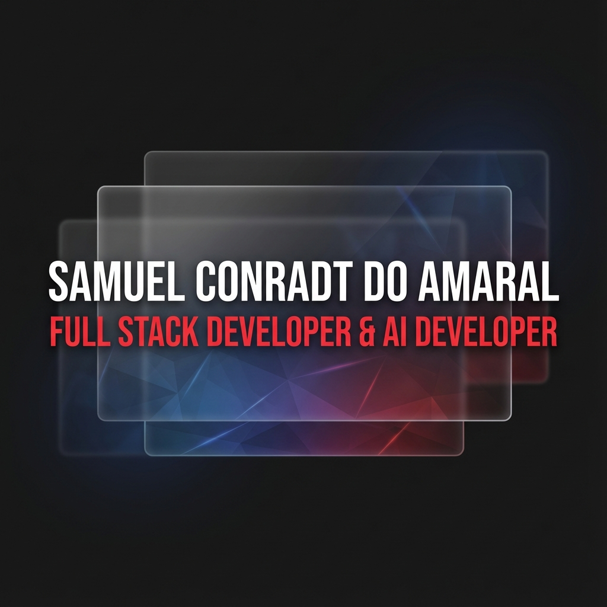

# 🚀 Portfólio Samuel Conradt do Amaral

<div align="center">



**Desenvolvedor Full Stack & AI Developer**

[](https://samuel.redstoneweb.com.br)
[](https://www.linkedin.com/in/samuel-conradt-b5a77b27a)
[](https://github.com/SameDev)

</div>

---

## 📋 Sobre o Projeto

Portfólio profissional desenvolvido com **Nuxt 3** e **Vue.js**, apresentando uma interface moderna com design **glassmorphism** e **animações fluidas**. O projeto foi construído com foco em **performance**, **SEO** e **experiência do usuário**.

## 🛠️ Tecnologias Utilizadas

### Core
- **[Nuxt 3](https://nuxt.com/)** - Framework Vue.js para produção
- **[Vue 3](https://vuejs.org/)** - Framework JavaScript progressivo
- **[TypeScript](https://www.typescriptlang.org/)** - Superset JavaScript tipado

### Styling
- **[SCSS](https://sass-lang.com/)** - Pré-processador CSS
- **Glassmorphism** - Efeitos de vidro modernos
- **CSS Animations** - Animações nativas e performáticas

### SEO & Performance
- **[@nuxtjs/seo](https://nuxtseo.com/)** - Módulo oficial de SEO
- **[@nuxt/image](https://image.nuxt.com/)** - Otimização de imagens
- **Schema.org JSON-LD** - Dados estruturados para motores de busca

---

## 📂 Estrutura do Projeto

```
portifolio/
├── assets/
│   └── styles/
│       ├── core/
│       │   ├── _globals.scss      # Estilos globais
│       │   └── _variables.scss    # Variáveis SCSS
│       └── components/
│           ├── _header.scss       # Estilos do header
│           └── _footer.scss       # Estilos do footer
├── components/
│   ├── Header.vue                 # Componente de cabeçalho
│   ├── Footer.vue                 # Componente de rodapé
│   ├── ProjectCard.vue            # Card de projeto
│   └── TimelineItem.vue           # Item da timeline
├── pages/
│   ├── index.vue                  # Página principal
│   └── links.vue                  # Página de links sociais
├── public/
│   ├── images/                    # Imagens estáticas
│   ├── robots.txt                 # Configuração de crawlers
│   └── sitemap.xml                # Mapa do site
├── app.vue                        # Componente raiz
├── nuxt.config.ts                 # Configuração do Nuxt
└── package.json                   # Dependências do projeto
```

---

## 🚀 Como Executar

### Pré-requisitos

- **Node.js** 18.x ou superior
- **npm**, **yarn**, **pnpm** ou **bun**

### Instalação

```bash
# Clone o repositório
git clone https://github.com/SameDev/portifolio.git

# Entre no diretório
cd portifolio

# Instale as dependências
npm install
```

### Desenvolvimento

```bash
# Inicie o servidor de desenvolvimento
npm run dev
```

Acesse [http://localhost:3000](http://localhost:3000) no seu navegador.

### Build para Produção

```bash
# Gere a build otimizada
npm run build

# Visualize a build localmente
npm run preview
```

### Geração Estática

```bash
# Gere site estático (SSG)
npm run generate
```

---

## 🎨 Seções do Portfólio

### 🏠 Hero
Apresentação principal com nome, título e call-to-actions

### 👨‍💻 Sobre Mim
Descrição profissional e foto de perfil

### 💼 Projetos Principais
- **Starting Music** - Plataforma de streaming com ML
- **VonIA** - IA para auxiliar estudantes de computação
- **GymCalc** - Sistema de gestão para academias
- **TuneSound** - E-commerce de instrumentos musicais

### 🏢 Experiência Profissional
Timeline com histórico profissional detalhado

### 🤖 IA & Pesquisa
Projetos e estudos relacionados a Inteligência Artificial

### 📞 Contato
Links para LinkedIn, GitHub e Email

---

## 🔍 SEO & Performance

### Meta Tags Implementadas
- ✅ Title e Description otimizados
- ✅ Keywords relevantes
- ✅ Open Graph (Facebook/LinkedIn)
- ✅ Twitter Cards
- ✅ Canonical URL
- ✅ Language (pt-BR)

### Structured Data (Schema.org)
- ✅ Person Schema
- ✅ WebSite Schema
- ✅ WebPage Schema

### Ferramentas de Validação
- [Google Rich Results Test](https://search.google.com/test/rich-results)
- [Facebook Sharing Debugger](https://developers.facebook.com/tools/debug/)
- [Twitter Card Validator](https://cards-dev.twitter.com/validator)

---

## 🌐 Deploy

O projeto está hospedado em **Vercel** com deploy automático:

- **URL de Produção**: [https://samuel.redstoneweb.com.br](https://samuel.redstoneweb.com.br)
- **Deploy Automático**: Push para `main` branch

### Deploy Manual

```bash
# Build de produção
npm run build

# Deploy para Vercel
vercel --prod
```

---

## 📝 Licença

Este projeto é de uso pessoal e portfólio profissional.

---

## 👤 Autor

**Samuel Conradt do Amaral**

- 🌐 Website: [samuel.redstoneweb.com.br](https://samuel.redstoneweb.com.br)
- 💼 LinkedIn: [@samuel-conradt](https://www.linkedin.com/in/samuel-conradt-b5a77b27a)
- 🐙 GitHub: [@SameDev](https://github.com/SameDev)
- 📧 Email: conradtsamuel@gmail.com

---

## 🙏 Agradecimentos
- Hospedagem por [Vercel](https://vercel.com/)

---

<div align="center">

**Desenvolvido com ❤️ por Samuel Conradt**

⭐ Se você gostou deste projeto, considere dar uma estrela!

</div>
